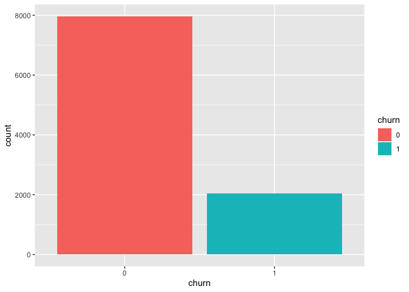
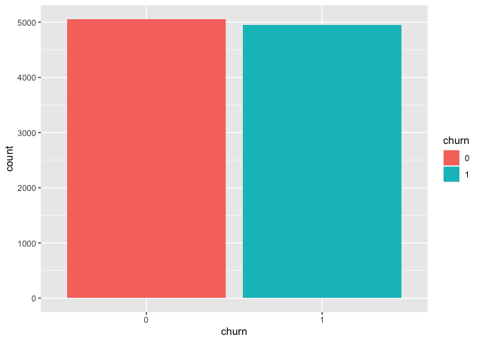

Classification Analysis
================
Le Hai Trieu Tran
2024-05-14

## Part 1.

1.  Model comparison (20 points) – include the code used Using the own
    data develop two classification models (different kinds) and compare
    them.

<!-- -->

1.  Make sure the data set is balanced

2.  Use two different sizes of the data set. The sizes should be
    different by a magnitude of at least two times. For instance, two
    sizes – 50 and 100. Generate a training set and a test set for each
    size.

3.  Run both classifiers for the data. You should have eight results
    -Two for each classifier times two for each size times two for the
    train and test set.

4.  Compare the result of the different classifiers. Which classifier
    model would you use and why?

5.  Using bagging and boosting and the same data sets carry out the same
    analysis as above.

6.  Compare the results of classifiers and the bagging/boosting results.

``` r
#load data
library(readr)
library(dplyr)
library(forecast)
bank <- read_csv("/Users/trieutlh/Library/CloudStorage/OneDrive-UW/Archive/TBANLT 560/final exam/data/bank_churn.csv")
head(bank)
```

    ## # A tibble: 6 × 12
    ##   customer_id credit_score country gender   age tenure balance products_number
    ##         <dbl>        <dbl> <chr>   <chr>  <dbl>  <dbl>   <dbl>           <dbl>
    ## 1    15634602          619 France  Female    42      2      0                1
    ## 2    15647311          608 Spain   Female    41      1  83808.               1
    ## 3    15619304          502 France  Female    42      8 159661.               3
    ## 4    15701354          699 France  Female    39      1      0                2
    ## 5    15737888          850 Spain   Female    43      2 125511.               1
    ## 6    15574012          645 Spain   Male      44      8 113756.               2
    ## # ℹ 4 more variables: credit_card <dbl>, active_member <dbl>,
    ## #   estimated_salary <dbl>, churn <dbl>

``` r
summary(bank)
```

    ##   customer_id        credit_score     country             gender         
    ##  Min.   :15565701   Min.   :350.0   Length:10000       Length:10000      
    ##  1st Qu.:15628528   1st Qu.:584.0   Class :character   Class :character  
    ##  Median :15690738   Median :652.0   Mode  :character   Mode  :character  
    ##  Mean   :15690941   Mean   :650.5                                        
    ##  3rd Qu.:15753234   3rd Qu.:718.0                                        
    ##  Max.   :15815690   Max.   :850.0                                        
    ##       age            tenure          balance       products_number
    ##  Min.   :18.00   Min.   : 0.000   Min.   :     0   Min.   :1.00   
    ##  1st Qu.:32.00   1st Qu.: 3.000   1st Qu.:     0   1st Qu.:1.00   
    ##  Median :37.00   Median : 5.000   Median : 97199   Median :1.00   
    ##  Mean   :38.92   Mean   : 5.013   Mean   : 76486   Mean   :1.53   
    ##  3rd Qu.:44.00   3rd Qu.: 7.000   3rd Qu.:127644   3rd Qu.:2.00   
    ##  Max.   :92.00   Max.   :10.000   Max.   :250898   Max.   :4.00   
    ##   credit_card     active_member    estimated_salary        churn       
    ##  Min.   :0.0000   Min.   :0.0000   Min.   :    11.58   Min.   :0.0000  
    ##  1st Qu.:0.0000   1st Qu.:0.0000   1st Qu.: 51002.11   1st Qu.:0.0000  
    ##  Median :1.0000   Median :1.0000   Median :100193.91   Median :0.0000  
    ##  Mean   :0.7055   Mean   :0.5151   Mean   :100090.24   Mean   :0.2037  
    ##  3rd Qu.:1.0000   3rd Qu.:1.0000   3rd Qu.:149388.25   3rd Qu.:0.0000  
    ##  Max.   :1.0000   Max.   :1.0000   Max.   :199992.48   Max.   :1.0000

### A. Make sure the data set is balanced – you will want to do that theself. Describe and justify the method for balancing the data set.

``` r
#initial look at the data
table(bank$churn)
```

    ## 
    ##    0    1 
    ## 7963 2037

``` r
bank$churn <- as.factor(bank$churn)
library(ggplot2)
g <- ggplot(bank, aes(fill = churn)) + geom_bar(aes(x = churn))
g
```

<!-- -->

``` r
file_path <- "/Users/trieutlh/Library/CloudStorage/OneDrive-UW/Archive/TBANLT 560/final exam/figures/q1"
ggsave(file=file.path(file_path, "q1_g.png"),
       g, width=5, height=8, units="in")
```

This data has about 20% of Minority Class (churn = 1), so it is an
imbalanced dataset. I will use ROSE package to undersampling the data.
*Describe the process:*

- ROSE Package Installation and Loading: The ROSE package is installed
  using the install.packages() function and loaded into R with
  library(ROSE).
- Determining Sampling Fraction: The total number of samples in the
  dataset is calculated, and a new sampling fraction (new_frac) is
  defined, which is set to 0.5 in this case.
- Combining Undersampling and Oversampling: ovun.sample() function from
  the ROSE package is utilized to perform both undersampling and
  oversampling.
- Sampling Result: The operation is executed, resulting in a sampled
  dataset (sampled_bank), which now has a balanced distribution of
  classes.
- Visualization: A bar plot is created using ggplot() to visualize the
  distribution of the churn variable in the sampled dataset after
  sampling.

``` r
#Installing and Loading ROSE Package
if(!require(ROSE)) install.packages("ROSE")
library(ROSE)

#Determining Sampling Fraction 
n_new <- nrow(bank)
new_frac <- 0.5

#Combine both Undersampling and Oversampling
sampling_result <- ovun.sample(formula = churn ~., data = bank,
                                 method = "both", 
                                 N = n_new,
                                 p = new_frac,
                                 seed = 10)

sampled_bank <- sampling_result$data
table(sampled_bank$churn)
```

    ## 
    ##    0    1 
    ## 5055 4945

``` r
g2 <- ggplot(sampled_bank, aes(fill = churn)) + geom_bar(aes(x = churn))
g2
```

<!-- -->

``` r
ggsave(file=file.path(file_path, "q1_g2.png"),
       g2, width=5, height=8, units="in")
```

This is the result data after undersampling.

### B. Use two different sizes of the data set. The sizes should be different by a magnitude of at least two times. For instance, two sizes – 50 and 100.

Generate a training set and a test set for each size. (There will be
four sets total.)

``` r
#Change numerical variables to categorical
sampled_bank$churn <- as.factor(sampled_bank$churn)
sampled_bank$products_number <- as.factor(sampled_bank$products_number)
sampled_bank$active_member <- as.factor(sampled_bank$active_member)
sampled_bank$credit_card <- as.factor(sampled_bank$credit_card)

#Normalize data
library(caret)
```

    ## Loading required package: lattice

``` r
norm_values <- preProcess(sampled_bank, method = "scale")
bank_data1 <- predict(norm_values, sampled_bank)
bank_data1 <- bank_data1[-1] #customer_id excluded

#Partition data 
set.seed(10)
index <- sample(row.names(bank_data1), 0.5*dim(bank_data1)[1]) 
bank_data2 <- bank_data1[index, ]

#bank_data1: Generate a training set and a test set
set.seed(10)
train.index_data1 <- sample(c(1:dim(bank_data1)[1]), dim(bank_data1)[1]*0.6) 
train_data1 <- bank_data1[train.index_data1, ] 
valid_data1 <- bank_data1[-train.index_data1, ]

#bank_data2: Generate a training set and a test set
set.seed(10)
train.index_data2 <- sample(c(1:dim(bank_data2)[1]), dim(bank_data2)[1]*0.6) 
train_data2 <- bank_data2[train.index_data2, ] 
valid_data2 <- bank_data2[-train.index_data2, ]
```

### C. Run both classifiers for the data. You should have eight results -Two for each classifier times two for each size times two for the train and test set.

``` r
#Model 1: Naive Bayes using train_data1 and valid_data1
library(e1071)

#Run Naive Bayes 
bank_data1_nb <- naiveBayes(churn ~ ., data = train_data1)
bank_data1_nb
```

    ## 
    ## Naive Bayes Classifier for Discrete Predictors
    ## 
    ## Call:
    ## naiveBayes.default(x = X, y = Y, laplace = laplace)
    ## 
    ## A-priori probabilities:
    ## Y
    ##     0     1 
    ## 0.499 0.501 
    ## 
    ## Conditional probabilities:
    ##    credit_score
    ## Y       [,1]      [,2]
    ##   0 6.627267 0.9622509
    ##   1 6.588653 1.0315324
    ## 
    ##    country
    ## Y      France   Germany     Spain
    ##   0 0.5043420 0.2241149 0.2715431
    ##   1 0.3962076 0.3992016 0.2045908
    ## 
    ##    gender
    ## Y      Female      Male
    ##   0 0.4288577 0.5711423
    ##   1 0.5698603 0.4301397
    ## 
    ##    age
    ## Y       [,1]      [,2]
    ##   0 3.549832 0.9700411
    ##   1 4.229443 0.9182857
    ## 
    ##    tenure
    ## Y       [,1]      [,2]
    ##   0 1.747622 0.9836065
    ##   1 1.673544 1.0153027
    ## 
    ##    balance
    ## Y       [,1]      [,2]
    ##   0 1.185696 1.0274337
    ##   1 1.468241 0.9500429
    ## 
    ##    products_number
    ## Y             1           2           3           4
    ##   0 0.453907816 0.540414162 0.005678023 0.000000000
    ##   1 0.695608782 0.157684631 0.116433799 0.030272788
    ## 
    ##    credit_card
    ## Y           0         1
    ##   0 0.2899132 0.7100868
    ##   1 0.2940785 0.7059215
    ## 
    ##    active_member
    ## Y           0         1
    ##   0 0.4592518 0.5407482
    ##   1 0.6513639 0.3486361
    ## 
    ##    estimated_salary
    ## Y       [,1]      [,2]
    ##   0 1.722071 0.9955172
    ##   1 1.774683 1.0061098

``` r
#Predict on train_data1
#predict probabilities
pred.prob <- predict(bank_data1_nb, newdata=train_data1, type="raw")
#predict class membership
pred.class <- predict(bank_data1_nb, newdata=train_data1)

df <- data.frame(actual = train_data1$churn, predicted = pred.class, pred.prob)
head(df)
```

    ##   actual predicted         X0         X1
    ## 1      0         1 0.47177144 0.52822856
    ## 2      0         0 0.88124639 0.11875361
    ## 3      1         1 0.06360923 0.93639077
    ## 4      0         0 0.52011671 0.47988329
    ## 5      0         0 0.93146202 0.06853798
    ## 6      1         0 0.50511387 0.49488613

``` r
#result 1
#train_data1 
#accuracy
accuracy(as.numeric(pred.class), as.numeric(train_data1$churn))
```

    ##                   ME      RMSE       MAE       MPE     MAPE
    ## Test set -0.01166667 0.5033223 0.2533333 -7.208333 19.29167

``` r
#Confusion matrix
pred.class <- predict(bank_data1_nb, newdata = train_data1) 
confusionMatrix(pred.class, train_data1$churn)
```

    ## Confusion Matrix and Statistics
    ## 
    ##           Reference
    ## Prediction    0    1
    ##          0 2199  725
    ##          1  795 2281
    ##                                           
    ##                Accuracy : 0.7467          
    ##                  95% CI : (0.7355, 0.7576)
    ##     No Information Rate : 0.501           
    ##     P-Value [Acc > NIR] : < 2e-16         
    ##                                           
    ##                   Kappa : 0.4933          
    ##                                           
    ##  Mcnemar's Test P-Value : 0.07676         
    ##                                           
    ##             Sensitivity : 0.7345          
    ##             Specificity : 0.7588          
    ##          Pos Pred Value : 0.7521          
    ##          Neg Pred Value : 0.7415          
    ##              Prevalence : 0.4990          
    ##          Detection Rate : 0.3665          
    ##    Detection Prevalence : 0.4873          
    ##       Balanced Accuracy : 0.7466          
    ##                                           
    ##        'Positive' Class : 0               
    ## 

``` r
#Predict on valid_data1
## predict probabilities
pred.prob <- predict(bank_data1_nb, newdata=valid_data1, type="raw")
## predict class membership
pred.class <- predict(bank_data1_nb, newdata=valid_data1)

df <- data.frame(actual = valid_data1$churn, predicted = pred.class, pred.prob)
head(df)
```

    ##   actual predicted        X0         X1
    ## 1      0         0 0.9300957 0.06990433
    ## 2      0         0 0.5245882 0.47541175
    ## 3      0         0 0.9275782 0.07242182
    ## 4      0         0 0.5640189 0.43598112
    ## 5      0         0 0.9273644 0.07263563
    ## 6      0         1 0.2635481 0.73645190

``` r
#result 2
#valid_data1 
#accuracy
accuracy(as.numeric(pred.class), as.numeric(valid_data1$churn))
```

    ##                ME     RMSE     MAE   MPE MAPE
    ## Test set -0.00875 0.513566 0.26375 -7.25   20

``` r
#Confusion matrix
pred.class <- predict(bank_data1_nb, newdata = valid_data1) 
confusionMatrix(pred.class, valid_data1$churn)
```

    ## Confusion Matrix and Statistics
    ## 
    ##           Reference
    ## Prediction    0    1
    ##          0 1516  510
    ##          1  545 1429
    ##                                           
    ##                Accuracy : 0.7362          
    ##                  95% CI : (0.7223, 0.7499)
    ##     No Information Rate : 0.5152          
    ##     P-Value [Acc > NIR] : <2e-16          
    ##                                           
    ##                   Kappa : 0.4723          
    ##                                           
    ##  Mcnemar's Test P-Value : 0.2952          
    ##                                           
    ##             Sensitivity : 0.7356          
    ##             Specificity : 0.7370          
    ##          Pos Pred Value : 0.7483          
    ##          Neg Pred Value : 0.7239          
    ##              Prevalence : 0.5152          
    ##          Detection Rate : 0.3790          
    ##    Detection Prevalence : 0.5065          
    ##       Balanced Accuracy : 0.7363          
    ##                                           
    ##        'Positive' Class : 0               
    ## 

``` r
#Model 1: Naive Bayes using train_data2 and valid_data2
library(e1071)

#Run Naive Bayes 
bank_data2_nb <- naiveBayes(churn ~ ., data = train_data2)
bank_data2_nb
```

    ## 
    ## Naive Bayes Classifier for Discrete Predictors
    ## 
    ## Call:
    ## naiveBayes.default(x = X, y = Y, laplace = laplace)
    ## 
    ## A-priori probabilities:
    ## Y
    ##         0         1 
    ## 0.5043333 0.4956667 
    ## 
    ## Conditional probabilities:
    ##    credit_score
    ## Y       [,1]      [,2]
    ##   0 6.640786 0.9555546
    ##   1 6.616963 1.0293078
    ## 
    ##    country
    ## Y      France   Germany     Spain
    ##   0 0.5042961 0.2154660 0.2802379
    ##   1 0.3947545 0.3960995 0.2091459
    ## 
    ##    gender
    ## Y      Female      Male
    ##   0 0.4196960 0.5803040
    ##   1 0.5400134 0.4599866
    ## 
    ##    age
    ## Y       [,1]      [,2]
    ##   0 3.588884 0.9966964
    ##   1 4.232797 0.9297306
    ## 
    ##    tenure
    ## Y       [,1]     [,2]
    ##   0 1.745777 0.967871
    ##   1 1.661382 1.019275
    ## 
    ##    balance
    ## Y       [,1]     [,2]
    ##   0 1.137579 1.026706
    ##   1 1.470908 0.944271
    ## 
    ##    products_number
    ## Y            1          2          3          4
    ##   0 0.44877726 0.54659617 0.00462657 0.00000000
    ##   1 0.69468729 0.15601883 0.11701412 0.03227976
    ## 
    ##    credit_card
    ## Y           0         1
    ##   0 0.2894911 0.7105089
    ##   1 0.3100202 0.6899798
    ## 
    ##    active_member
    ## Y           0         1
    ##   0 0.4408460 0.5591540
    ##   1 0.6543376 0.3456624
    ## 
    ##    estimated_salary
    ## Y       [,1]      [,2]
    ##   0 1.701900 0.9955511
    ##   1 1.758496 1.0083395

``` r
#Predict on train_data2
#predict probabilities
pred.prob <- predict(bank_data2_nb, newdata=train_data2, type="raw")
#predict class membership
pred.class <- predict(bank_data2_nb, newdata=train_data2)

df <- data.frame(actual = train_data2$churn, predicted = pred.class, pred.prob)
head(df)
```

    ##   actual predicted         X0         X1
    ## 1      0         1 0.32673911 0.67326089
    ## 2      1         1 0.06143922 0.93856078
    ## 3      0         1 0.24757245 0.75242755
    ## 4      0         0 0.96568751 0.03431249
    ## 5      0         0 0.80191533 0.19808467
    ## 6      0         0 0.69820325 0.30179675

``` r
#result 3
#train_data2
#accuracy
accuracy(as.numeric(pred.class), as.numeric(train_data2$churn))
```

    ##                   ME      RMSE   MAE   MPE     MAPE
    ## Test set -0.01233333 0.5147815 0.265 -7.55 20.18333

``` r
#Confusion matrix
pred.class <- predict(bank_data2_nb, newdata = train_data2) 
confusionMatrix(pred.class, train_data2$churn)
```

    ## Confusion Matrix and Statistics
    ## 
    ##           Reference
    ## Prediction    0    1
    ##          0 1097  379
    ##          1  416 1108
    ##                                           
    ##                Accuracy : 0.735           
    ##                  95% CI : (0.7188, 0.7507)
    ##     No Information Rate : 0.5043          
    ##     P-Value [Acc > NIR] : <2e-16          
    ##                                           
    ##                   Kappa : 0.4701          
    ##                                           
    ##  Mcnemar's Test P-Value : 0.2017          
    ##                                           
    ##             Sensitivity : 0.7250          
    ##             Specificity : 0.7451          
    ##          Pos Pred Value : 0.7432          
    ##          Neg Pred Value : 0.7270          
    ##              Prevalence : 0.5043          
    ##          Detection Rate : 0.3657          
    ##    Detection Prevalence : 0.4920          
    ##       Balanced Accuracy : 0.7351          
    ##                                           
    ##        'Positive' Class : 0               
    ## 

``` r
#Predict on valid_data2
#predict probabilities
pred.prob <- predict(bank_data2_nb, newdata=valid_data2, type="raw")
#predict class membership
pred.class <- predict(bank_data2_nb, newdata=valid_data2)

df <- data.frame(actual = valid_data2$churn, predicted = pred.class, pred.prob)
head(df)
```

    ##   actual predicted        X0        X1
    ## 1      0         0 0.8826566 0.1173434
    ## 2      0         1 0.4655840 0.5344160
    ## 3      1         1 0.4922698 0.5077302
    ## 4      1         1 0.1816141 0.8183859
    ## 5      1         0 0.7914288 0.2085712
    ## 6      1         1 0.4774630 0.5225370

``` r
#result 4
#valid_data2
#accuracy
accuracy(as.numeric(pred.class), as.numeric(valid_data2$churn))
```

    ##              ME RMSE  MAE    MPE   MAPE
    ## Test set -0.017  0.5 0.25 -7.525 19.175

``` r
#Confusion matrix
pred.class <- predict(bank_data2_nb, newdata = valid_data2) 
confusionMatrix(pred.class, valid_data2$churn)
```

    ## Confusion Matrix and Statistics
    ## 
    ##           Reference
    ## Prediction   0   1
    ##          0 712 233
    ##          1 267 788
    ##                                           
    ##                Accuracy : 0.75            
    ##                  95% CI : (0.7304, 0.7688)
    ##     No Information Rate : 0.5105          
    ##     P-Value [Acc > NIR] : <2e-16          
    ##                                           
    ##                   Kappa : 0.4994          
    ##                                           
    ##  Mcnemar's Test P-Value : 0.14            
    ##                                           
    ##             Sensitivity : 0.7273          
    ##             Specificity : 0.7718          
    ##          Pos Pred Value : 0.7534          
    ##          Neg Pred Value : 0.7469          
    ##              Prevalence : 0.4895          
    ##          Detection Rate : 0.3560          
    ##    Detection Prevalence : 0.4725          
    ##       Balanced Accuracy : 0.7495          
    ##                                           
    ##        'Positive' Class : 0               
    ## 

``` r
# Model 2: Logistic regression using train_data1 and valid_data1
# run logistic regression # use glm() (general linear model) with family = "binomial" to fit a logistic # regression.
options(scipen=999)
model2 <- glm(churn ~ ., data = train_data1, family = "binomial")  
model2
```

    ## 
    ## Call:  glm(formula = churn ~ ., family = "binomial", data = train_data1)
    ## 
    ## Coefficients:
    ##      (Intercept)      credit_score    countryGermany      countrySpain  
    ##         -1.45323          -0.05909           0.82578          -0.03596  
    ##       genderMale               age            tenure           balance  
    ##         -0.66387           0.77327          -0.09571          -0.01043  
    ## products_number2  products_number3  products_number4      credit_card1  
    ##         -1.62482           2.65383          15.93291          -0.09420  
    ##   active_member1  estimated_salary  
    ##         -1.01592           0.02434  
    ## 
    ## Degrees of Freedom: 5999 Total (i.e. Null);  5986 Residual
    ## Null Deviance:       8318 
    ## Residual Deviance: 5940  AIC: 5968

``` r
#predict on train_data1
model2.pred.train <- predict(model2, train_data1, type = "response")
model2.preb.train.binary <- ifelse(model2.pred.train>0.5,1,0)
#predict on valid_data1
model2.pred.valid <- predict(model2, valid_data1, type = "response")
model2.preb.valid.binary <- ifelse(model2.pred.valid>0.5,1,0)
```

``` r
#result 5
#train_data1
#accuracy
accuracy(model2.preb.train.binary, as.numeric(train_data1$churn))
```

    ##                ME     RMSE      MAE      MPE     MAPE
    ## Test set 1.001833 1.113328 1.001833 69.19167 69.19167

``` r
#Confusion matrix
model2.pred <- predict(model2, train_data1, type = "response")
confusionMatrix(as.factor(ifelse(model2.pred > 0.5, 1, 0)), 
                train_data1$churn)
```

    ## Confusion Matrix and Statistics
    ## 
    ##           Reference
    ## Prediction    0    1
    ##          0 2292  713
    ##          1  702 2293
    ##                                              
    ##                Accuracy : 0.7642             
    ##                  95% CI : (0.7532, 0.7749)   
    ##     No Information Rate : 0.501              
    ##     P-Value [Acc > NIR] : <0.0000000000000002
    ##                                              
    ##                   Kappa : 0.5283             
    ##                                              
    ##  Mcnemar's Test P-Value : 0.7904             
    ##                                              
    ##             Sensitivity : 0.7655             
    ##             Specificity : 0.7628             
    ##          Pos Pred Value : 0.7627             
    ##          Neg Pred Value : 0.7656             
    ##              Prevalence : 0.4990             
    ##          Detection Rate : 0.3820             
    ##    Detection Prevalence : 0.5008             
    ##       Balanced Accuracy : 0.7642             
    ##                                              
    ##        'Positive' Class : 0                  
    ## 

``` r
#result 6
#valid_data1
#accuracy
accuracy(model2.preb.valid.binary, as.numeric(valid_data1$churn))
```

    ##               ME     RMSE     MAE     MPE    MAPE
    ## Test set 1.00875 1.125056 1.00875 70.2125 70.2125

``` r
#Confusion matrix
model2.pred <- predict(model2, valid_data1, type = "response")
confusionMatrix(as.factor(ifelse(model2.pred > 0.5, 1, 0)), 
                valid_data1$churn)
```

    ## Confusion Matrix and Statistics
    ## 
    ##           Reference
    ## Prediction    0    1
    ##          0 1582  514
    ##          1  479 1425
    ##                                              
    ##                Accuracy : 0.7518             
    ##                  95% CI : (0.7381, 0.7651)   
    ##     No Information Rate : 0.5152             
    ##     P-Value [Acc > NIR] : <0.0000000000000002
    ##                                              
    ##                   Kappa : 0.5028             
    ##                                              
    ##  Mcnemar's Test P-Value : 0.2806             
    ##                                              
    ##             Sensitivity : 0.7676             
    ##             Specificity : 0.7349             
    ##          Pos Pred Value : 0.7548             
    ##          Neg Pred Value : 0.7484             
    ##              Prevalence : 0.5152             
    ##          Detection Rate : 0.3955             
    ##    Detection Prevalence : 0.5240             
    ##       Balanced Accuracy : 0.7513             
    ##                                              
    ##        'Positive' Class : 0                  
    ## 

``` r
# Model 2: Logistic regression using train_data2 and valid_data2
# run logistic regression # use glm() (general linear model) with family = "binomial" to fit a logistic # regression.
options(scipen=999)
model2 <- glm(churn ~ ., data = train_data2, family = "binomial")  
model2
```

    ## 
    ## Call:  glm(formula = churn ~ ., family = "binomial", data = train_data2)
    ## 
    ## Coefficients:
    ##      (Intercept)      credit_score    countryGermany      countrySpain  
    ##         -1.43005          -0.03093           0.71830          -0.04595  
    ##       genderMale               age            tenure           balance  
    ##         -0.60934           0.70184          -0.08930           0.07233  
    ## products_number2  products_number3  products_number4      credit_card1  
    ##         -1.52905           2.84788          15.98402          -0.17109  
    ##   active_member1  estimated_salary  
    ##         -1.08777           0.02088  
    ## 
    ## Degrees of Freedom: 2999 Total (i.e. Null);  2986 Residual
    ## Null Deviance:       4159 
    ## Residual Deviance: 2994  AIC: 3022

``` r
#predict on train_data2
model2.pred <- predict(model2, train_data2, type = "response")
model2.preb.binary <- ifelse(model2.pred>0.5,1,0)

#predict on valid_data2
model2.pred.valid <- predict(model2, valid_data2, type = "response")
model2.preb.valid.binary <- ifelse(model2.pred.valid>0.5,1,0)
```

``` r
#result 7
#train_data2
#accuracy
accuracy(model2.preb.binary, as.numeric(train_data2$churn))
```

    ##                 ME     RMSE       MAE      MPE     MAPE
    ## Test set 0.9983333 1.118481 0.9983333 68.73333 68.73333

``` r
#Confusion matrix
model2.pred <- predict(model2, train_data2, type = "response")
confusionMatrix(as.factor(ifelse(model2.pred > 0.5, 1, 0)), 
                train_data2$churn)
```

    ## Confusion Matrix and Statistics
    ## 
    ##           Reference
    ## Prediction    0    1
    ##          0 1129  379
    ##          1  384 1108
    ##                                              
    ##                Accuracy : 0.7457             
    ##                  95% CI : (0.7297, 0.7612)   
    ##     No Information Rate : 0.5043             
    ##     P-Value [Acc > NIR] : <0.0000000000000002
    ##                                              
    ##                   Kappa : 0.4913             
    ##                                              
    ##  Mcnemar's Test P-Value : 0.8849             
    ##                                              
    ##             Sensitivity : 0.7462             
    ##             Specificity : 0.7451             
    ##          Pos Pred Value : 0.7487             
    ##          Neg Pred Value : 0.7426             
    ##              Prevalence : 0.5043             
    ##          Detection Rate : 0.3763             
    ##    Detection Prevalence : 0.5027             
    ##       Balanced Accuracy : 0.7457             
    ##                                              
    ##        'Positive' Class : 0                  
    ## 

``` r
#result 8
#valid_data2
#accuracy
accuracy(model2.preb.binary, as.numeric(valid_data2$churn))
```

    ##             ME  RMSE   MAE   MPE  MAPE
    ## Test set 1.023 1.249 1.023 63.35 63.35

``` r
#Confusion matrix
model2.pred <- predict(model2, valid_data2, type = "response")
confusionMatrix(as.factor(ifelse(model2.pred > 0.5, 1, 0)), 
                valid_data2$churn)
```

    ## Confusion Matrix and Statistics
    ## 
    ##           Reference
    ## Prediction   0   1
    ##          0 744 248
    ##          1 235 773
    ##                                              
    ##                Accuracy : 0.7585             
    ##                  95% CI : (0.7391, 0.7771)   
    ##     No Information Rate : 0.5105             
    ##     P-Value [Acc > NIR] : <0.0000000000000002
    ##                                              
    ##                   Kappa : 0.5169             
    ##                                              
    ##  Mcnemar's Test P-Value : 0.5851             
    ##                                              
    ##             Sensitivity : 0.7600             
    ##             Specificity : 0.7571             
    ##          Pos Pred Value : 0.7500             
    ##          Neg Pred Value : 0.7669             
    ##              Prevalence : 0.4895             
    ##          Detection Rate : 0.3720             
    ##    Detection Prevalence : 0.4960             
    ##       Balanced Accuracy : 0.7585             
    ##                                              
    ##        'Positive' Class : 0                  
    ## 

### D. Compare the result of the different classifiers. Which classifier model would you use and why?

Compare the result of the different classifiers:

- Accuracy: Both classifiers seem to perform similarly in terms of
  accuracy, with Naïve Bayes slightly outperforming Logistic Regression
  on some datasets.  
- ME, RMSE, and MAE: Naïve Bayes generally shows lower error metrics
  (ME, RMSE, MAE) compared to Logistic Regression, indicating better
  performance in terms of prediction accuracy.  
- MPE and MAPE: Naïve Bayes also shows lower MPE and MAPE values,
  suggesting better accuracy in predicting the target variable
  (churn).  
  Conclusion: In this case, we should use Naïve Bayes, because it
  exhibits lower error rates and better MPE and MAPE compared to
  Logistic Regression.

### E. Using bagging and boosting

``` r
if(!require(adabag)) install.packages("adabag")
library(adabag) 
library(rpart)
```

``` r
# bagging 
bag <- bagging(churn ~ ., data = train_data1)
pred <- predict(bag, valid_data1, type = "class") 
```

``` r
# boosting 
boost <- boosting(churn ~ ., data = train_data1) 
pred <- predict(boost, valid_data1, type = "class") 
```

### F. Compare the results of classifiers and the bagging/boosting results. Put the results here and discuss the results.

``` r
# bagging result
bag <- bagging(churn ~ ., data = train_data1)
pred <- predict(bag, valid_data1, type = "class") 
accuracy(as.numeric(pred$class), as.numeric(valid_data1$churn))
```

    ##              ME     RMSE    MAE     MPE    MAPE
    ## Test set 0.9755 1.087428 0.9755 68.1375 68.1375

``` r
confusionMatrix(as.factor(pred$class), valid_data1$churn)
```

    ## Confusion Matrix and Statistics
    ## 
    ##           Reference
    ## Prediction    0    1
    ##          0 1549  414
    ##          1  512 1525
    ##                                                
    ##                Accuracy : 0.7685               
    ##                  95% CI : (0.7551, 0.7815)     
    ##     No Information Rate : 0.5152               
    ##     P-Value [Acc > NIR] : < 0.00000000000000022
    ##                                                
    ##                   Kappa : 0.5373               
    ##                                                
    ##  Mcnemar's Test P-Value : 0.001435             
    ##                                                
    ##             Sensitivity : 0.7516               
    ##             Specificity : 0.7865               
    ##          Pos Pred Value : 0.7891               
    ##          Neg Pred Value : 0.7486               
    ##              Prevalence : 0.5152               
    ##          Detection Rate : 0.3872               
    ##    Detection Prevalence : 0.4908               
    ##       Balanced Accuracy : 0.7690               
    ##                                                
    ##        'Positive' Class : 0                    
    ## 

``` r
# boosting result
boost <- boosting(churn ~ ., data = train_data1) 
pred <- predict(boost, valid_data1, type = "class") 
accuracy(as.numeric(pred$class), as.numeric(valid_data1$churn))
```

    ##               ME     RMSE     MAE     MPE    MAPE
    ## Test set 0.99775 1.097155 0.99775 70.3875 70.3875

``` r
confusionMatrix(as.factor(pred$class), valid_data1$churn)
```

    ## Confusion Matrix and Statistics
    ## 
    ##           Reference
    ## Prediction    0    1
    ##          0 1640  412
    ##          1  421 1527
    ##                                              
    ##                Accuracy : 0.7918             
    ##                  95% CI : (0.7788, 0.8042)   
    ##     No Information Rate : 0.5152             
    ##     P-Value [Acc > NIR] : <0.0000000000000002
    ##                                              
    ##                   Kappa : 0.5832             
    ##                                              
    ##  Mcnemar's Test P-Value : 0.7816             
    ##                                              
    ##             Sensitivity : 0.7957             
    ##             Specificity : 0.7875             
    ##          Pos Pred Value : 0.7992             
    ##          Neg Pred Value : 0.7839             
    ##              Prevalence : 0.5152             
    ##          Detection Rate : 0.4100             
    ##    Detection Prevalence : 0.5130             
    ##       Balanced Accuracy : 0.7916             
    ##                                              
    ##        'Positive' Class : 0                  
    ## 

*Compare the results of classifiers and the bagging/boosting results:*  
\* Accuracy: Boosting has the highest accuracy among all methods.  
\* ME, RMSE, and MAE: Boosting and Bagging generally have lower error
metrics compared to Naïve Bayes and Logistic Regression, indicating
better performance in terms of prediction accuracy.  
\* MPE and MAPE: Boosting and Bagging also show lower MPE and MAPE
values, suggesting better accuracy in predicting the target variable
compared to Naïve Bayes and Logistic Regression.  
Conclusion:  
Boosting seems to be the best performing model among all the classifiers
in this case, with the highest accuracy and lower error metrics. Bagging
also performs well but slightly less than boosting.  
Naïve Bayes and Logistic Regression do not perform as well as Bagging
and Boosting in this scenario.
